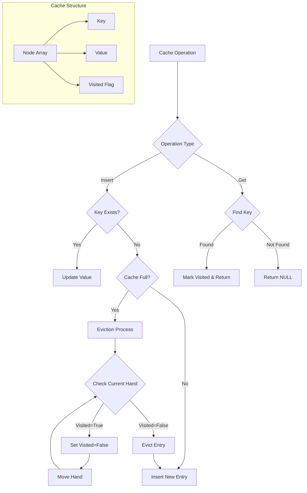

# SIEVE Cache Implementation

A C implementation of the SIEVE cache eviction algorithm, based on the research paper (https://junchengyang.com/publication/nsdi24-SIEVE.pdf)

## Overview

This project implements the SIEVE cache eviction algorithm, which offers:
- Simpler implementation than LRU
- Better efficiency than many state-of-the-art algorithms
- Superior scalability with no locking required for cache hits
- Potential to be used as a cache primitive like FIFO and LRU

## Implementation

The cache is implemented with these key components:
- Fixed-size array of cache entries
- Each entry contains:
  - Key (string)
  - Value (integer)
  - Visited flag
-  hand pointer for eviction
- No complex data structures required

Flowchart


### Building the Project

```bash
mkdir build
cd build
cmake ..
make
```

### Usage

```c
// Create a cache
Cache *cache = create_cache(size);

// Insert a key-value pair
insert(cache, "key", value);

// Retrieve a value
int *value = get(cache, "key");

// Free the cache
free_cache(cache);
```

## Directory Structure

```
sieve/
├── CMakeLists.txt
├── include/
│   └── sieve.h
├── src/
│   └── sieve.c
└── tests/
    └── test.c
```

## Algorithm Details

The implementation follows the SIEVE algorithm's clock-based approach:
1. The hand moves through the cache
2. If it finds an unvisited entry, that entry is evicted
3. If an entry is visited, its visited flag is cleared and the hand moves on
4. If all entries are visited, the hand will eventually return to evict the first entry it finds

